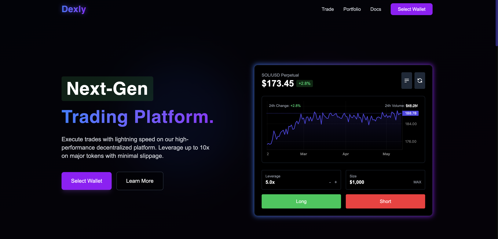

# Dexly - Perpetual Futures Trading on Solana

Dexly is a decentralized perpetual futures trading platform built on the Solana blockchain using the Anchor framework. It enables users to open leveraged long or short positions on assets like SOL/USDC and BTC/USDC, with margin and collateral fully managed on-chain — without depending on a traditional orderbook. The platform uses smart contracts for execution and a Rust-based backend for off-chain indexing and real-time updates.

Designed for transparency and performance, Dexly combines the speed of Solana with a clean trading interface built in Next.js, offering traders a seamless, trustless way to speculate on crypto prices with leverage.


## Project Structure

The project is divided into three main components:

- **Frontend**: Next.js application with TailwindCSS for the UI
- **Backend**: Rust server using Axum for API endpoints
- **Smart Contracts**: Solana programs written in Rust with Anchor framework

## Features

- Connect Phantom wallet
- View real-time SOL/USD price charts
- Open long/short positions with up to 10x leverage
- View and manage open positions
- Automatic liquidation system
- PnL calculation
- Next-Gen Trading Platform with digital interface
- Lightning-fast execution on Solana
- Real-time price charts and market data
- Non-custodial architecture keeps your funds secure


## Development Setup

### Prerequisites

- Node.js 16+
- Rust and Cargo
- Solana CLI
- Anchor framework

### Frontend Setup

```bash
cd frontend
npm install
npm run dev
```

### Backend Setup

```bash
cd backend
cargo run
```

### Smart Contract Setup

```bash
cd contracts/perpgo
anchor build
anchor deploy
```

## Architecture


### Smart Contracts

The Solana programs handle:
- Opening and closing positions
- Managing collateral
- Calculating liquidation prices
- Tracking funding rates

### Backend

The Rust backend provides:
- REST API for position data
- WebSocket for real-time updates
- Liquidation bot monitoring
- User history tracking

### Frontend

The Next.js frontend offers:
- Interactive trading UI
- Real-time price charts
- Position management
- Wallet integration

## Current Status

This is an MVP (Minimum Viable Product) with basic functionality. Future improvements will include:
- More trading pairs
- Advanced order types
- Improved risk management
- Enhanced charting capabilities

## License

MIT 
